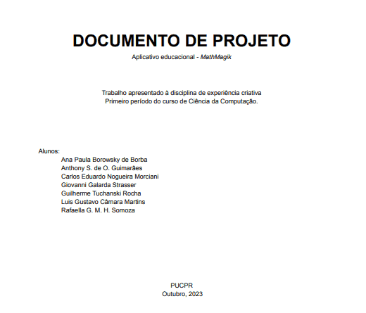

# Mathmagik

## Projeto
Este foi um projeto desenvolvido no primeiro semestre (2023) do curso na disciplina Experiência Criativa, que é uma disciplina extensionista. O objetivo era ser um aplicativo educacional multimídia. Para definição de qual seria o tema e como seria este aplicativo, fizemos uma pesquisa extensa com vários alunos e professores do ensino fundamental. Foi com base nela que definimos que fazer um jogo/ quiz de matemática seria uma ideia interessante. O aplicativo conta com banco de dados de questões de matemática do primeiro ao quinto ano do ensino fundamental e foi escrito em java, em um software chamado Processing. Nosso trabalho foi elogiado pelo professor, e é inclusive utilizado como exemplo para os calouros.

## Documento
Para ler o documento do projeto, com as pesquisas realizadas com alunos e professores, e sobre as decisões tomadas ao longo deste trabalho, acesse a página "documents", e abra o arquivo "Documento de projeto".

## Como rodar
Para rodar o Mathmagik, você deve baixar o programa chamado Processing, [aqui](https://processing.org/).
Instale o programa, clique em abrir e escolha o arquivo chamado "ProjetoEC". Em seguida clique no simbolo de play, e é só jogar!
